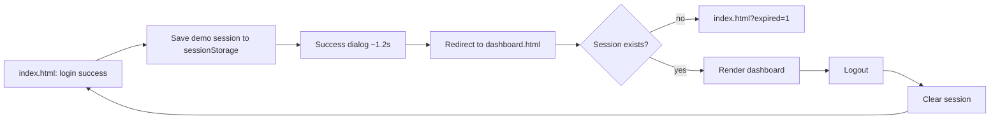

# AutoPulse CRM — Dashboard Design

**Date:** 2026-10-06
**Status:** Approved
**Scope:** Frontend-only portfolio demo (no backend)
**Depends on:** `2026-10-06-automotive-crm-prd.md`, existing login (`index.html`, `styles.css`, `app.js`)

---

## 0. Decisions

| Topic | Decision |
| :--- | :--- |
| Target roles | HRD & People Ops (default) + Branch Manager, switchable via role dropdown |
| Scope | One rich **Overview** page + sidebar; other menu items show a "Segera hadir / Coming soon" badge and toast |
| Charts | Hand-built SVG + CSS, no chart library |
| Architecture | Approach A: separate `dashboard.html` / `dashboard.css` / `dashboard.js`, reuse `styles.css` tokens, sessionStorage session guard |

---

## 1. Layout & Content

```
+-----------+------------------------------------------------------------+
| AutoPulse | Topbar: Page title · Branch ▾ · Role ▾ (HRD/BM)            |
|           |         · ID|EN · theme · bell · Avatar (menu: Logout)     |
| ▸Overview +------------------------------------------------------------+
|  Attendance| [KPI 1]   [KPI 2]   [KPI 3]   [KPI 4]                    |
|  Commission+------------------------------------+-----------------------+
|  Team     | Main chart (7/30-day trend)        | Side panel            |
|  Leads    +------------------------------------+-----------------------+
|  Reports  | Detail table / list                | Activity feed         |
| (Coming   +------------------------------------+-----------------------+
|  soon)    |                                                            |
+-----------+------------------------------------------------------------+
```

- Mobile: sidebar becomes an off-canvas drawer (☰ button).
- Non-Overview menu items carry a "Segera hadir" badge; clicking shows a toast.

### Content per role (same skeleton, different data)

| Area | HRD & People Ops (default) | Branch Manager |
| :--- | :--- | :--- |
| 4 KPIs | Attendance today · Staff on leave · Technician utilization · Estimated SPK commission (month) | Units sold (month) · Service units today · Lead→SPK conversion · CSAT |
| Main chart | 30-day attendance trend per division (line) | Weekly sales vs target (bar) |
| Side panel | Donut: staff status (present/leave/sick/late) | Gauge: monthly target achievement |
| Table | Staff attendance & KPI (name, division, check-in, status, KPI score) + division filter + search + sort | Sales leaderboard (SPK, % target, active leads) |
| Feed | Pending leave requests (demo Approve/Reject) | Workshop stall queue & operational alerts |

- **Branch** dropdown uses the same 5 branches as login (`jkt`, `bsd`, `bdg`, `sby`, `mdn`); all numbers change per branch.
- All data is **deterministic seeded mock** — identical on every load.

---

## 2. Data Flow, Session, Errors



- **Session** key `autopulse-session` (sessionStorage): `{ name, role, branch, loginAt }`. Cleared when tab closes.
- **Login changes are minimal:** save session + redirect; success dialog button becomes "Buka Dashboard / Open Dashboard" plus auto-redirect.
- **Guard:** opening `dashboard.html` without a session redirects to `index.html?expired=1`, which shows "Sesi berakhir, silakan masuk kembali".

### Shared preferences
- Theme & language reuse `localStorage` keys `autopulse-theme`, `autopulse-lang` — changes sync both pages.
- Dashboard branch & role are written back into the session (`AutoPulseSession.update`), so they survive refresh and reset on a new login.

### Mock data
- `getDashboardData(role, branch)` → `{ kpis, chart, side, table, feed }`, seeded per branch.
- Wrapped in ~400 ms latency; **skeleton loaders** shown meanwhile.
- On branch/role change: skeleton → re-render → KPI counter animation.
- Demo actions (Approve/Reject leave) mutate in-memory state, show a **toast**, update badge count.

### Errors & edge cases

| Condition | Behavior |
| :--- | :--- |
| `?offline=1` | Cards show "Data tidak tersedia" + **Retry**; sidebar/topbar still work. Retry simulates a recovered connection (clears the forced-offline flag) |
| Empty table after filter/search | Empty state "Tidak ada staf yang cocok" |
| Storage blocked | Fallback to defaults (`try/catch`, same pattern as login) |
| `prefers-reduced-motion` | Counter & chart animations disabled |

---

## 3. Files, Components, Accessibility, Verification

### Files

| File | Status | Content |
| :--- | :--- | :--- |
| `dashboard.html` | New | Semantic shell: `<aside>` sidebar, `<header>` topbar, `<main>` card grid, toast region |
| `dashboard.css` | New | Dashboard layout only, scoped under `body.page-dashboard` |
| `dashboard.js` | New | Guard wiring, theme/lang, SVG chart rendering, table/feed, interactions |
| `dashboard-data.js` | New (UMD) | Seeded mock generator `getDashboardData(role, branch)` — testable in Node |
| `dashboard-i18n.js` | New (UMD) | ID/EN dictionary for the dashboard — testable in Node |
| `session.js` | New (UMD) | `save / read / update / clear` demo session, shared by login & dashboard |
| `tests/*.test.js` | New | `node --test` suites (no dependencies) |
| `styles.css` | Reused, unchanged | Theme tokens, fonts, lang/theme toggles, buttons, modal styles |
| `app.js` | Minor change | Save session + redirect on success; handle `?expired=1` |
| `index.html` | Minor change | Load `session.js`; success dialog button "Buka Dashboard" |

### Components (vanilla SVG/CSS)
- **KPI card:** icon, animated counter, ▲/▼ trend chip (`--success`/`--danger`), mini sparkline.
- **Line & bar charts (SVG):** subtle grid, cyan gradient area, hover/focus tooltip per point, clickable legend to toggle series.
- **Donut & gauge:** `stroke-dasharray`, same technique as login attendance ring.
- **Staff table:** colored status badges, KPI score bar, division filter, search, column sort; becomes card list on mobile.
- **Leave feed:** initials avatar, Approve/Reject, exit animation.
- **Common:** glassmorphism + glow from login, 0.3s theme transition, skeleton shimmer, bottom-right toasts.

### Accessibility
- Proper landmarks (`nav`, `main`, `header`), single `<h1>`, "Skip to content" link.
- Each chart: `role="img"` + summary `aria-label`, plus visually-hidden data table.
- Role/branch dropdowns and avatar menu fully keyboard operable (Esc closes, focus returns).
- Toasts via `aria-live="polite"`; contrast checked in both themes.

### Verification
1. `node --check dashboard.js` and `node --check app.js`.
2. Node script: every i18n key exists in both ID and EN; every `id` referenced in JS exists in HTML.
3. Browser: login → redirect → switch role/branch/theme/language → approve leave → logout → open `dashboard.html` directly (must be rejected) → `?offline=1`; widths 375 / 768 / 1440 px.
